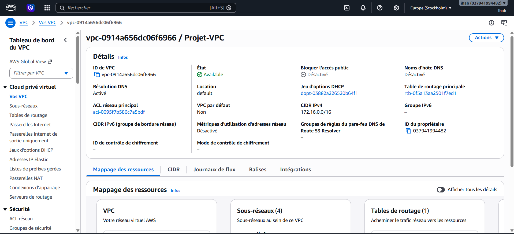
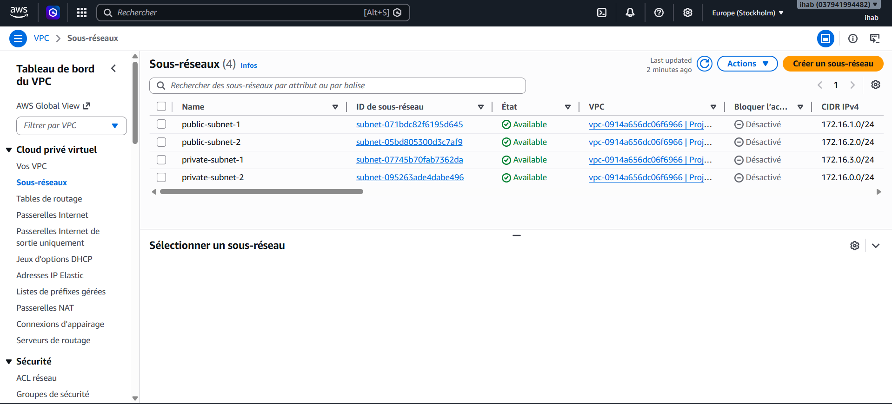
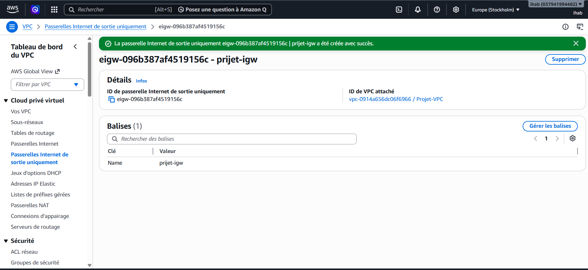
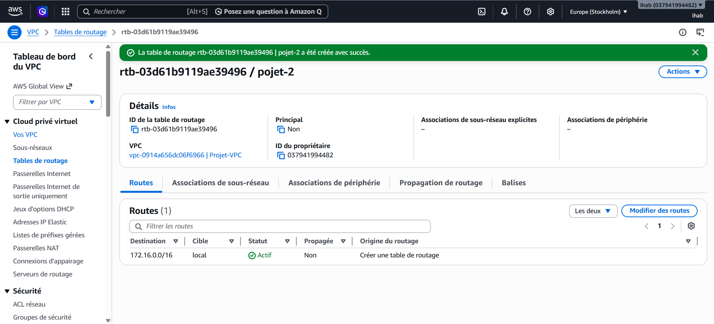
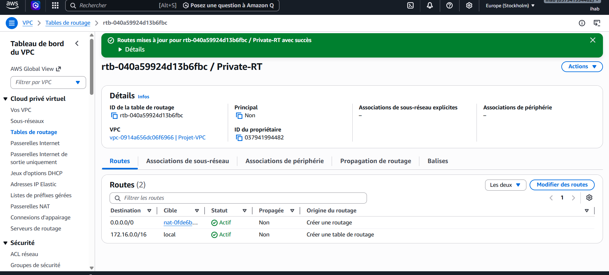
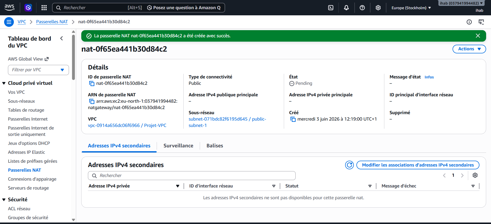
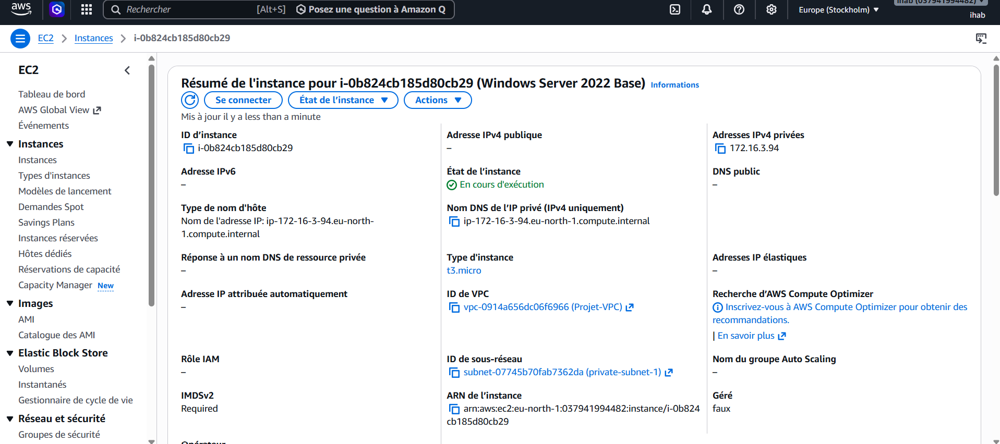
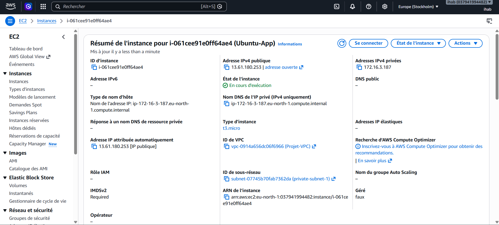
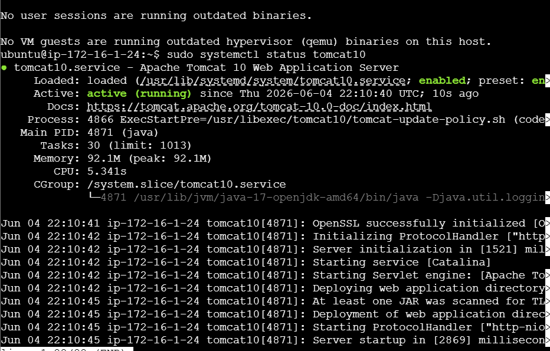
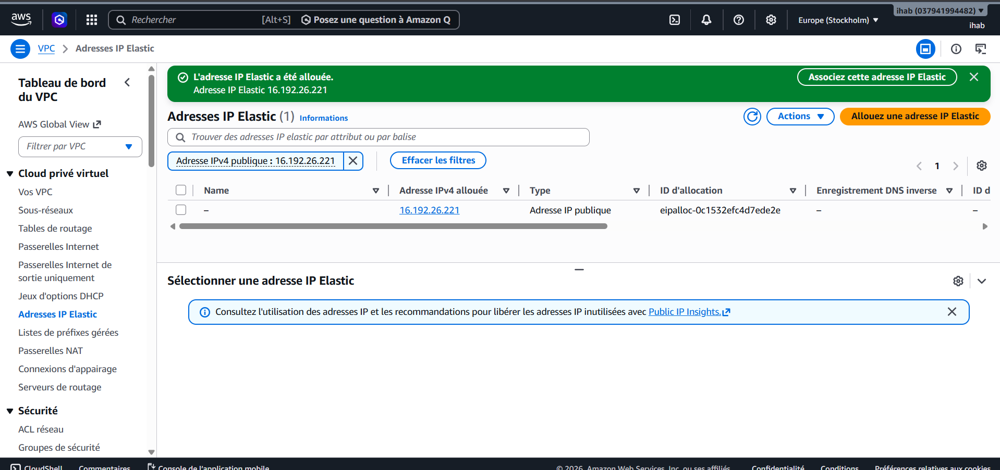

# ☁️ CloudSecure - AWS Infrastructure Project

## 📌 Description

Ce projet consiste à déployer une infrastructure cloud complète sur Amazon Web Services (AWS).

L'infrastructure comprend :

- VPC personnalisé
- Sous-réseaux Public et Private
- Internet Gateway
- NAT Gateway
- Tables de routage
- Elastic IP
- Instances EC2 Ubuntu et Windows Server
- Apache Web Server
- Apache Tomcat
- Java 17
- Active Directory Domain Services (AD DS)
- DNS
- DHCP
- Group Policy (GPO)

---

# 🏗️ Architecture

- 1 VPC
- 2 Public Subnets
- 2 Private Subnets
- Internet Gateway
- NAT Gateway
- Route Tables
- Ubuntu Web Server
- Ubuntu Application Server
- Windows Server 2022

---

# 🛠️ Technologies utilisées

- Amazon AWS
- Amazon VPC
- EC2
- Elastic IP
- NAT Gateway
- Internet Gateway
- Route Tables
- Ubuntu Server
- Windows Server 2022
- Apache2
- Apache Tomcat 10
- Java 17
- Active Directory
- DNS
- DHCP
- Group Policy

---

# ✅ Fonctionnalités

- Création du VPC
- Création des sous-réseaux
- Configuration des tables de routage
- Déploiement d'instances EC2
- Installation d'Apache
- Installation de Java
- Installation de Tomcat
- Déploiement d'un serveur Windows
- Installation d'Active Directory
- Installation DNS
- Installation DHCP
- Création des OU
- Création des GPO

---

## 📸 Screenshots

### 🏗️ AWS Infrastructure

#### 🌐 VPC Configuration
Configuration du Virtual Private Cloud (VPC) qui constitue le réseau principal de l'infrastructure AWS.

---

#### 🌍 Subnets
Création des sous-réseaux publics et privés pour isoler les différentes ressources.

---

#### 🚪 Internet Gateway & Default Route
Configuration de la passerelle Internet permettant l'accès au réseau public.

---

#### 🛣️ Public Route Table
Configuration de la table de routage du réseau public.

---

#### 🔒 Private Route Table
Configuration de la table de routage dédiée aux sous-réseaux privés.

---

#### 🌍 NAT Gateway
Configuration du NAT Gateway afin de permettre aux ressources privées d'accéder à Internet en toute sécurité.

---

## 💻 Windows Server

#### 🖥️ Windows Server Deployment
Déploiement et configuration du serveur Windows dans AWS.

---

#### 🌐 Active Directory Domain Services
Installation d'Active Directory Domain Services (AD DS), DNS et promotion du serveur en contrôleur de domaine.

---

#### 🏢 Domain Creation
Création du domaine Active Directory.

---

#### 👥 Organizational Units (OU)
Création des unités d'organisation (OU) pour structurer les utilisateurs et les ordinateurs.

---

#### 🔐 Group Policy (GPO)
Création et configuration des stratégies de groupe (GPO).

---

## ☁️ Ubuntu Application Server

#### 🐧 Ubuntu EC2 Instance
Déploiement du serveur Ubuntu destiné à héberger les applications.

---

#### ☕ Java Installation
Installation de Java nécessaire à l'exécution des applications.

---

#### 🐱 Apache Tomcat
Installation et configuration du serveur Apache Tomcat.

---

#### 🌐 Apache Web Server
Configuration du serveur web Apache.

---

## 📊 Monitoring

#### 📈 Elasticsearch
Installation et configuration d'Elasticsearch pour l'indexation et l'analyse des logs.

