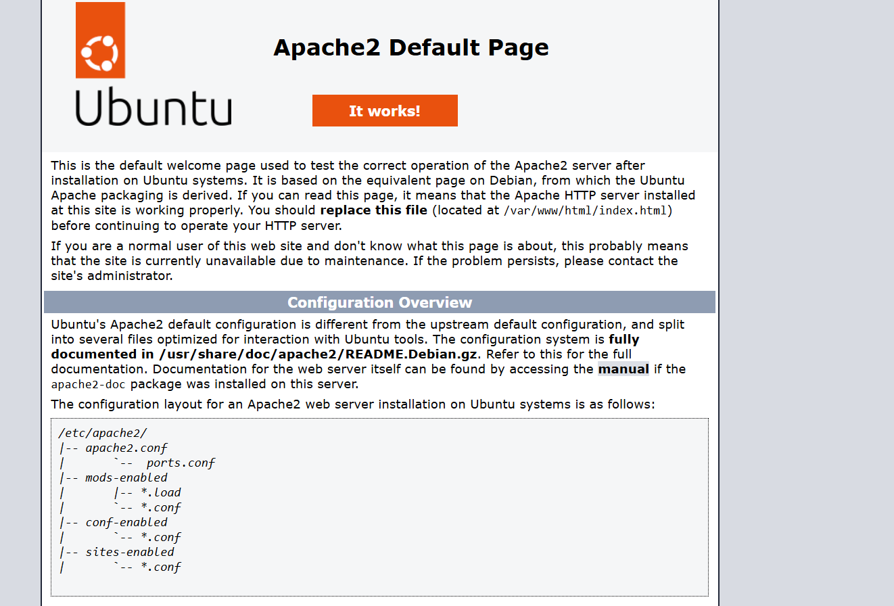
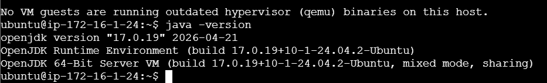
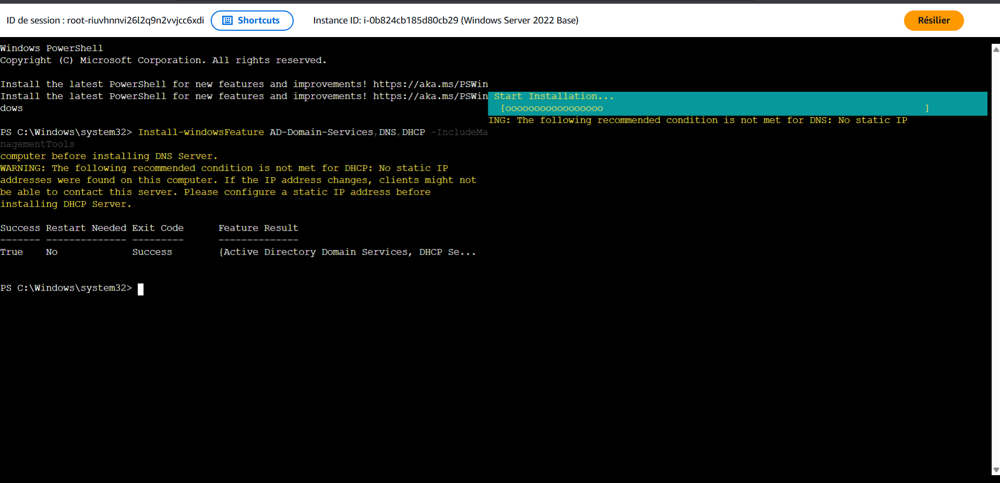
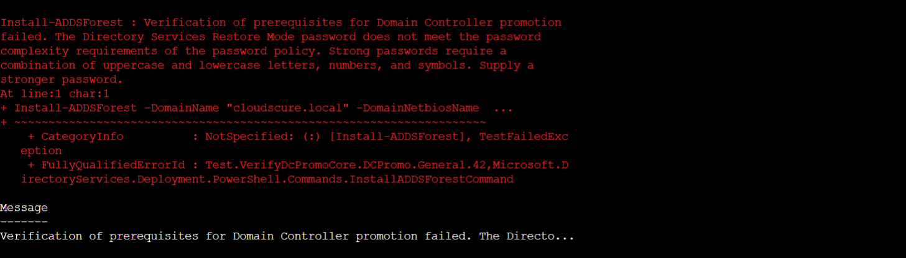
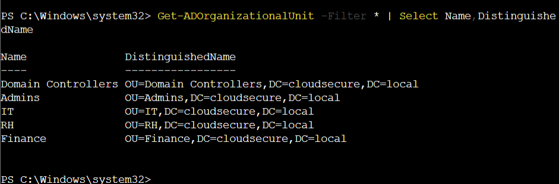
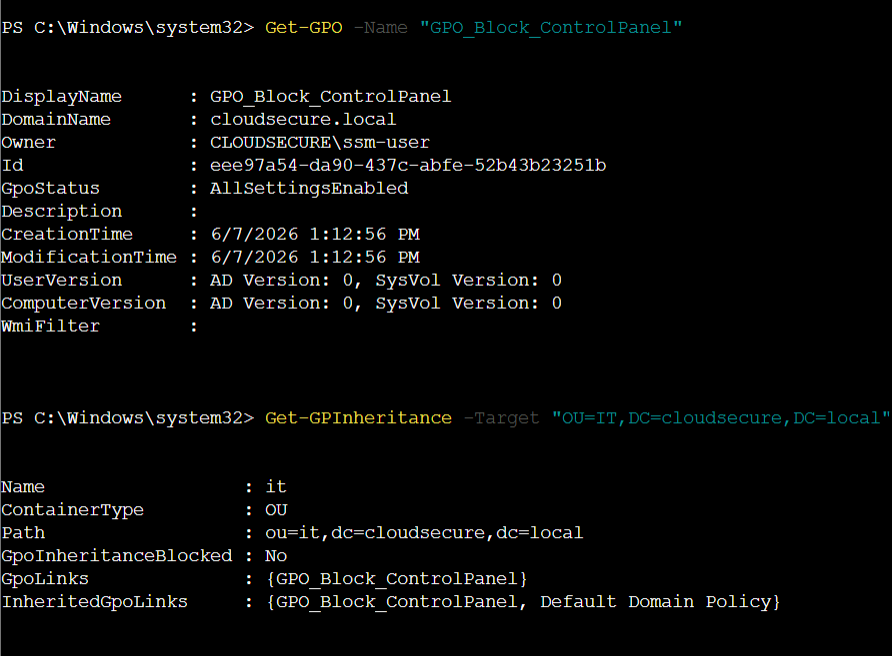

# ☁️ CloudSecure - AWS Infrastructure Project

## 📌 Description

Ce projet consiste à déployer une infrastructure cloud complète sur Amazon Web Services (AWS).

L'infrastructure comprend :

- VPC personnalisé
- Sous-réseaux Public et Private
- Internet Gateway
- NAT Gateway
- Tables de routage
- Elastic IP
- Instances EC2 Ubuntu et Windows Server
- Apache Web Server
- Apache Tomcat
- Java 17
- Active Directory Domain Services (AD DS)
- DNS
- DHCP
- Group Policy (GPO)

---

# 🏗️ Architecture

- 1 VPC
- 2 Public Subnets
- 2 Private Subnets
- Internet Gateway
- NAT Gateway
- Route Tables
- Ubuntu Web Server
- Ubuntu Application Server
- Windows Server 2022

---

# 🛠️ Technologies utilisées

- Amazon AWS
- Amazon VPC
- EC2
- Elastic IP
- NAT Gateway
- Internet Gateway
- Route Tables
- Ubuntu Server
- Windows Server 2022
- Apache2
- Apache Tomcat 10
- Java 17
- Active Directory
- DNS
- DHCP
- Group Policy

---

# ✅ Fonctionnalités

- Création du VPC
- Création des sous-réseaux
- Configuration des tables de routage
- Déploiement d'instances EC2
- Installation d'Apache
- Installation de Java
- Installation de Tomcat
- Déploiement d'un serveur Windows
- Installation d'Active Directory
- Installation DNS
- Installation DHCP
- Création des OU
- Création des GPO

---

# 📷 Captures d'écran

## VPC

.png)

---

## Sous-réseaux

---

## Internet Gateway

---

## Elastic IP

---

## NAT Gateway

---

## Route Table (Public)

## Route Table (Private)

## Instance Ubuntu Web Server

## Apache Web Server

---

## Instance Ubuntu Application

---

## Installation Java

---

## Installation Apache Tomcat

---

## Instance Windows Server

---

## Installation AD DS, DNS et DHCP

---

## Création du domaine Active Directory

---

## Création des Organizational Units

---

## Création des Group Policies

---

# 👨‍💻 Auteur

**Ihab Hadaf**

Étudiant Ingénierie Informatique  
Spécialité : Systèmes, Réseaux et Cloud
